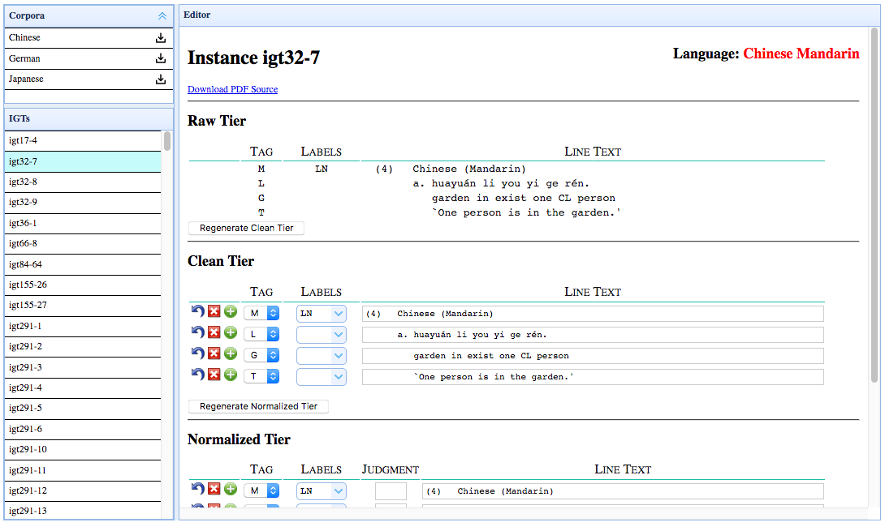

# igt-edit
This package is a [Flask](http://flask.pocoo.org/) web interface intended to make editing and cleaning IGT data in [`xigt`](https://github.com/xigt/xigt) format as easy as possible.

The interface allows annotators to clean lines of IGT, change the labels for the lines, and visualize the [INTENT](https://github.com/rgeorgi/intent)-enriched output.

## Dependencies
In addition to the files specified in `requirements.txt`, this editor expects to be run in combination with a `wsgi`interface. It has been tested with apache 2.4 and [`mod_wsgi`](https://modwsgi.readthedocs.io/en/develop/) . It also requires [INTENT](https://github.com/rgeorgi/intent), the location of which should be specified in `config.py`.

## Interface
